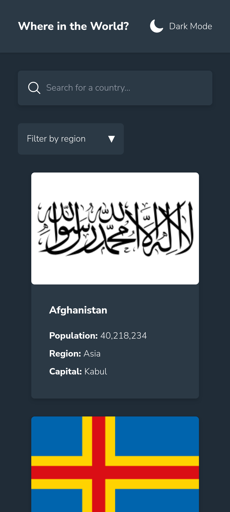
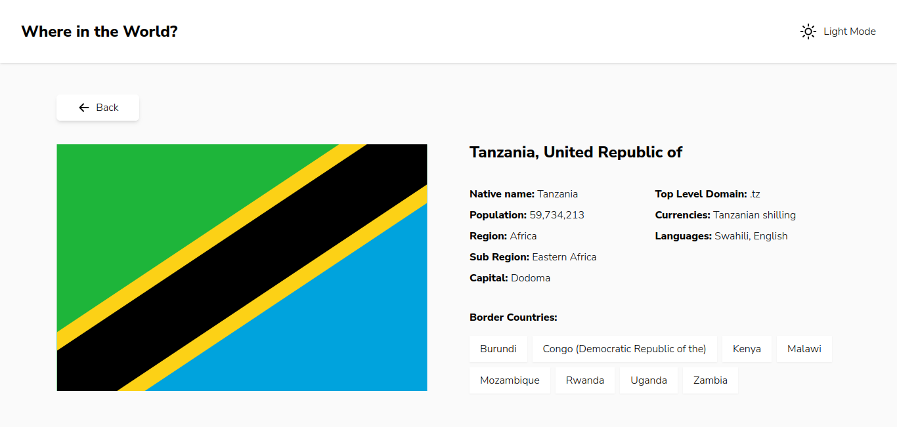

# Frontend Mentor - REST Countries API with color theme switcher solution

This is a solution to the [REST Countries API with color theme switcher challenge on Frontend Mentor](https://www.frontendmentor.io/challenges/rest-countries-api-with-color-theme-switcher-5cacc469fec04111f7b848ca). Frontend Mentor challenges help you improve your coding skills by building realistic projects.

## Table of contents

- [Overview](#overview)
  - [The challenge](#the-challenge)
  - [Screenshot](#screenshot)
  - [Links](#links)
- [My process](#my-process)
  - [Built with](#built-with)
  - [What I learned](#what-i-learned)
  - [Continued development](#continued-development)
  - [Useful resources](#useful-resources)
- [Author](#author)
- [Acknowledgments](#acknowledgments)

## Overview

### The challenge

Users should be able to:

- See all countries from the API on the homepage
- Search for a country using an `input` field
- Filter countries by region
- Click on a country to see more detailed information on a separate page
- Click through to the border countries on the detail page
- Toggle the color scheme between light and dark mode _(optional)_

### Screenshots




### Links

Live application - https://rest-countries-api-lake-eight.vercel.app/

## My process

### Data

I started by creating models of the data from the REST Countries API. I started working with the [data.json](./src/data.json) file provided in the project files. I implemented filter and search to work on the JSON file. When I finally got around to using the online API, I found that it was at version 3.1. The schema was quite different from that of the data in the JSON file (which is from version 2 of the api).

I found that the version 2 schema was simpler for this project, so I stuck with that.

Here's an example showing the schema differnces across the versions:

**Version 2**
URL: https://restcountries.com/v2/alpha/BEL?fields=name,nativeName

```json
{
  "name": "Belgium",
  "nativeName": "België"
}
```

**Version 3.1**
URL: https://restcountries.com/v3.1/alpha/BEL?fields=name,nativeName

```json
{
  "name": {
    "common": "Belgium",
    "nativeName": {
      "deu": {
        "common": "Belgien",
        "official": "Königreich Belgien"
      },
      "fra": {
        "common": "Belgique",
        "official": "Royaume de Belgique"
      },
      "nld": {
        "common": "België",
        "official": "Koninkrijk België"
      }
    },
    "official": "Kingdom of Belgium"
  }
}
```

Getting the `nativeName` for every country (using v3.1) would have been a nightmare.

I used simple bash scripts and [httpie](https://httpie.io/) to play with the endpoints required for this application, passing in various inputs.

For **home page** _(all countries and search)_

```bash
fields="name,population,region,flags,capital";

url="https://restcountries.com/v2/all?fields=${fields}";

if [[ -n $1 ]]; then
    countryName=$1;
    url="https://restcountries.com/v2/name/${countryName}?&fields=${fields}";
fi;

http "$url";
```

For **detail page** _(country by code)_

```bash
countryCode="$1";
version="$2";

if [[ -z $2 ]]; then
    version=2;
fi

url="https://restcountries.com/v${version}/alpha/${countryCode}?fields=name,nativeName,population,region,flags,capital,subregion,languages,topLevelDomain,currencies,borders"

echo "URL: $url";

http "$url";

```

All the while, I had simple markup that I used to check whether the data fetching was working fine.

### UI

After that, time was taken to refine the UI. I had started with a mobile-first approach. Therefore, after the data was done, I refined that mobile UI and then scaled it up to desktop.

Aftewards, I worked on the theme.

### Theme

Implementing dynamic theme came with some challenges due to server-side rendering (SSR). The intial page load from the server is not aware of the theme stored in the client's local storage with my intial attempt and therefore, the theme changed jarringly on page load from the default server theme to the client theme.

<!-- Demonstration GIF possibly? -->

I decided to make the [root layout](./src/app/layout.tsx) (save for the html and body tags) dynamically rendered which solved the problem, but created a new one. After the server payload reaches the client, an empty white page is displayed as the theme is loaded and any server functions are run before the full page is loaded with the correct theme.

It's still an issue, but not as big as the jarring theme change. I think I can live with it for now.

### Error handling

I finsihed up with accounting for errors in the data fetching code for cases where I did not and creating corresponing UI where needed.

Overally, I think the result is a bit OK. It's not perfect (e.g, does not show any indication of loading while sharing content and the styling) but I think that it meets the objectives outlined in the [challenge](#the-challenge) section. It's probably good enough to be submitted, at least (crosses fingers).

### Built with

- [Next.js](https://nextjs.org/) - React framework
- [Tailwind CSS](https://tailwindcss.com/) - CSS Framework

### What I learned

### Continued development

I'll probably try to work more on the issues mentioned above.

### Useful resources

- [Toggling dark mode manually in Tailwind CSS](https://tailwindcss.com/docs/dark-mode#toggling-dark-mode-manually)
- [Next.js docs](https://nextjs.org/docs) and the [Next.js Learn course](https://nextjs.org/learn), especially the search portion of the [Adding search and pagination section](https://nextjs.org/learn/dashboard-app/adding-search-and-pagination).
- [How to build custom form controls MDN article](https://developer.mozilla.org/en-US/docs/Learn/Forms/How_to_build_custom_form_controls) - Very helpful when I wanted to build the custom select seen on the design. I eventually decided to stick with the HTML default, for excellent reasons given in the same article on issues such as accessibility and covering all the interaction cases.

## Author

- Frontend Mentor - [@Mirror83](https://www.frontendmentor.io/profile/Mirror83)
- Twitter - [@glenochieng](https://www.twitter.com/glen_ochieng_)
